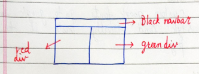

# Chapter 4 - Practice Set

## Instructions:

- [ ] Create The Following **Website layout**.
  

    

- [ ] **Add a footer** with [Google Font](https://fonts.google.com/ "Goto Google Fonts") to the *"Ballu Bhai"* to {Instruction 1}.
- [ ] **Remove the Undelines** from *links* in {Instruction 1}.
- [ ] **Demonstrate the difference** between *'display:none'* and *'visibility:hidden'* using a div tag.
- [ ] **Change the footer** to all the *uppercase* in {Instruction 1}.

---

### Status of Practice Set :

- [ ] Finished :+1:
- [ ] Verified by [W3C vaildator ](https://validator.w3.org/#validate_by_upload "Goto W3c vaildator")

---

### Source Link of Practice set:

- [Veiw the practice set](https://drive.google.com/file/d/1ixsoDb8mCuIZWCHQyOb7jc735BDDsiHe/view "Goto Practice Set")

---
### Leaning Source :

- [Watch Chapter - 4](https://youtu.be/Edsxf_NBFrw?t=10160 "Goto CSS tutorial by CodeWithHarry")
