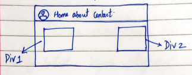
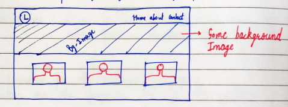

# Chapter 6 - Practice Set

## Instructions:

- [ ] **Create a layout** of your choice using float.
- [ ] **Create the same layout** in *{Instruction 1}* using **flexbox**.
- [ ] Create the following **navigation bar** using **flexbox**.
  

    

- [ ] Create the following **layout using flexbox**.

    

---

### Status of Practice Set :

- [ ] Finished :+1:
- [ ] Verified by [W3C vaildator ](https://validator.w3.org/#validate_by_upload "Goto W3c vaildator")

---

### Source Link of Practice set:

- [Veiw the practice set](https://drive.google.com/file/d/1ixsoDb8mCuIZWCHQyOb7jc735BDDsiHe/view "Goto Practice Set")

---
### Leaning Source :

- [Watch Chapter - 6](https://youtu.be/Edsxf_NBFrw?t=16559 "Goto CSS tutorial by CodeWithHarry")
