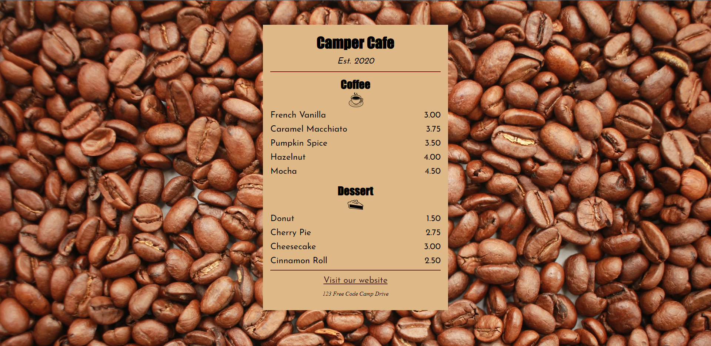

# [Camper Cafe](https://iamwatchdogs.github.io/Front-end/HTML_CSS/Project/2.CamperCafe/ "View Project Camper Cafe")

> **Camper Cafe** is a mini learning project offered by interactive learning session by [freecodecamp.org](https://www.freecodecamp.org/learn/)
> 
>
> Result:
>> [View the Page](https://iamwatchdogs.github.io/Front-end/HTML_CSS/Project/2.CamperCafe/ "View Project Camper Cafe")

## Requirements: 

>> HTML.
>
>> Beginners CSS concepts.

## Concepts covered:
```
- Grouping elements
- Basic syntax of a css styling property.
- background properties
- margin properties
- padding properties
- border properties
- responsive-ness
```

## Result:



## Used Sources:

- [Background Image](https://cdn.freecodecamp.org/curriculum/css-cafe/beans.jpg)
- [Coffee icon](https://cdn.freecodecamp.org/curriculum/css-cafe/coffee.jpg)
- [Pie icon](https://cdn.freecodecamp.org/curriculum/css-cafe/pie.jpg)
- [Josefin Sans ( Font used )](https://fonts.google.com/specimen/Josefin+Sans)

### Link:
> [https://www.freecodecamp.org/learn/2022/responsive-web-design/learn-basic-css-by-building-a-cafe-menu/](https://www.freecodecamp.org/learn/2022/responsive-web-design/learn-basic-css-by-building-a-cafe-menu/step-92)
